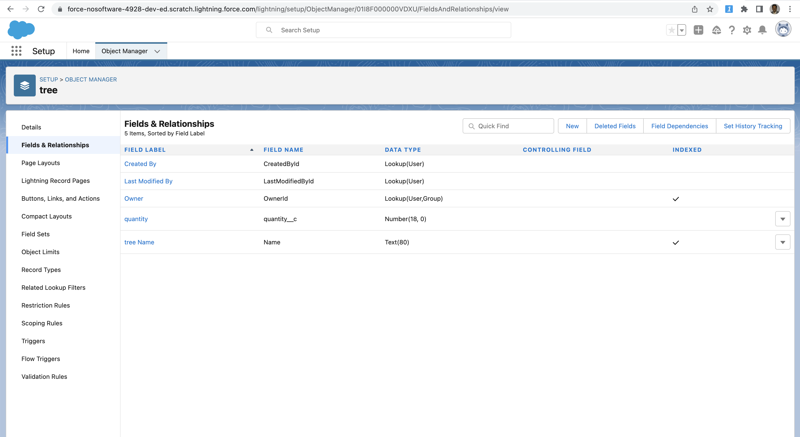
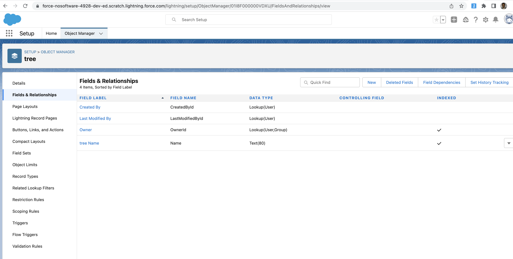
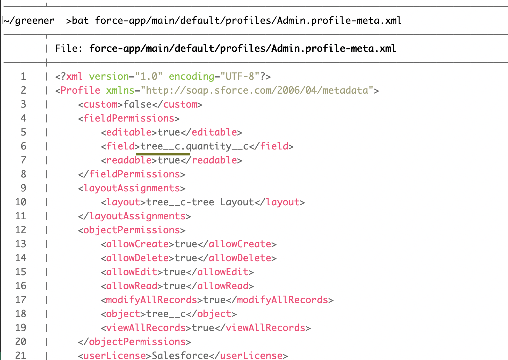
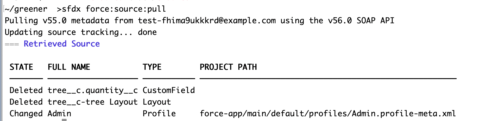
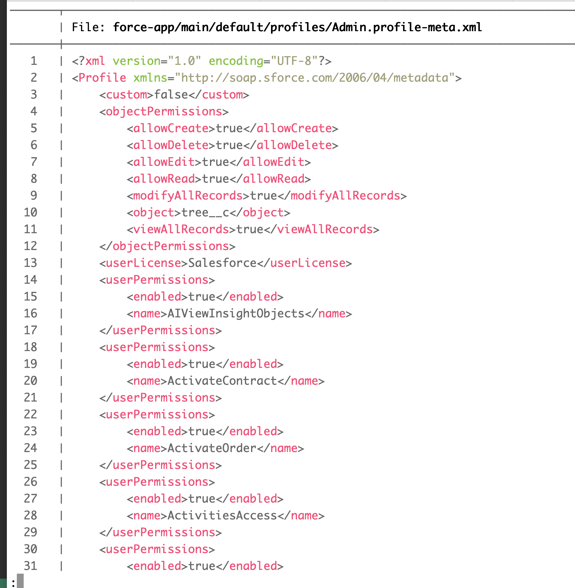
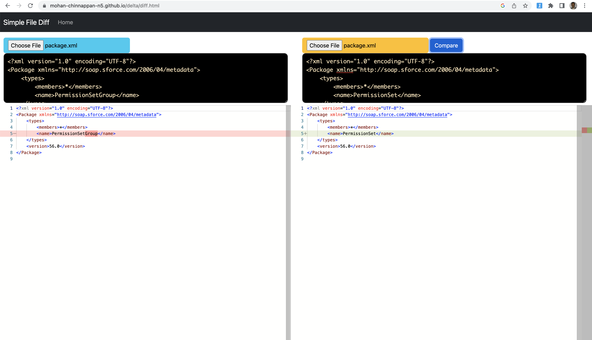
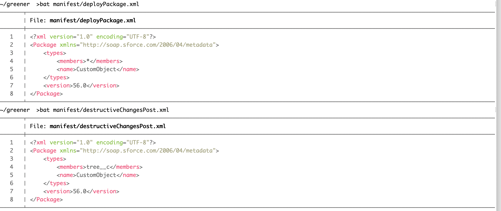
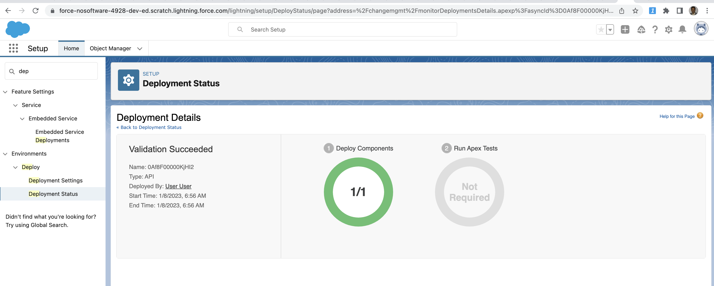

# How to compare 2 Salesforce Orgs metadata using DX and view the delta?

## Topics
- [How version control gets out-of-sync with the org?](#reasons)
- [How to compare metadata of 2 Orgs](#compare)
- [How to delete components using DX?](#delete)
- [How to do Delta deployments using DX](https://github.com/mohan-chinnappan-n/delta-deployment/blob/main/delta.md)
------
<a name='reasons'></a>
## What are the main reasons for the metadata in your version control becomes out-of-sync with metadata in the Org?
- Obvious one is:  when users make direct changes to the Org and not committing back these changes into the version control
    - If you remove for example, a custom field say (```tree__c.quantity__c```) using the org UI, Salesforce correctly removes entries for this field in Profiles (for example), but this change has to be committed into version control(using pull command). Otherwise that Profile in the version control will have a dangling field

    
    - User deletes the ```tree__c.quantity__c``` in Org UI
    
   ---- 
   - Dangling field in Profile
    
   - Perform source:pull
    
    - Dangling fixed by this source:pull
    
    -----

### Tools to find out the dangling fields
- [Dangling Fields](https://github.com/mohan-chinnappan-n/cli-dx/blob/master/mdapi/dangling-fields.md)

-----

<a name='compare'></a>

## Steps in comparing metadata of two orgs

- Login into two orgs using DX

### First Org

```
sfdx force:auth:web:login -r https://login.salesforce.com

Successfully authorized mohan.chinnappan.n.sel@gmail.com with org ID 00D4x000007rxoGEAQ

```
### Second Org
```
sfdx force:auth:web:login -r https://login.salesforce.com

Successfully authorized mohan.chinnappan.n.sel2@gmail.com with org ID 00D8W000004LymuUAC
```

- Prepare package.xml
    - Add metadata types as needed
``` 
cat package.xml
```
```xml
<?xml version="1.0" encoding="UTF-8"?>
<Package xmlns="http://soap.sforce.com/2006/04/metadata">
    <types>
        <members>*</members>
        <name>CustomObject</name>
    </types>
    <types>
        <members>*</members>
        <name>Profile</name>
    </types>
    <types>
        <members>*</members>
        <name>Permissionset</name>
    </types>
    <version>56.0</version>
</Package>

```

## Retrieve the metadata from both orgs

- make sure to create two 2 folders to store the retrieve results
    - in our case folders se and se2
```
mkdir se se2
```

### Retrieve the metadata from the first Org (se) 

```
sfdx force:mdapi:retrieve -k package.xml -u mohan.chinnappan.n.sel@gmail.com  -r se -z
Retrieving v56.0 metadata from mohan.chinnappan.n.sel@gmail.com using the v56.0 SOAP API
Retrieve ID: 09S4x00000E8o9qEAB
Retrieving metadata from mohan.chinnappan.n.sel@gmail.com... done
Wrote retrieve zip to /Users/mchinnappan/org-compare/se/unpackaged.zip
Extracted unpackaged.zip to: /Users/mchinnappan/org-compare/se/unpackaged
```

###  Retrieve the metadata from the second Org (se2)

```

sfdx force:mdapi:retrieve -k package.xml -u mohan.chinnappan.n.sel2@gmail.com  -r se2 -z
Retrieving v56.0 metadata from mohan.chinnappan.n.sel2@gmail.com using the v56.0 SOAP API
Retrieve ID: 09S8W00000DLiy0UAD
Retrieving metadata from mohan.chinnappan.n.sel2@gmail.com... done
Wrote retrieve zip to /Users/mchinnappan/org-compare/se2/unpackaged.zip
Extracted unpackaged.zip to: /Users/mchinnappan/org-compare/se2/unpackaged

```

## Using web based Simple Diff App to compare

- [Simple Diff App](https://mohan-chinnappan-n5.github.io/delta/diff.html)

[](https://mohan-chinnappan-n5.github.io/delta/diff.html)
## Using vim -d  OR  vimdiff to compare 

```
vimdiff  se/unpackaged/unpackaged/profiles/Admin.profile se2/unpackaged/unpackaged/profiles/Admin.profile 

OR

vim -d  se/unpackaged/unpackaged/profiles/Admin.profile se2/unpackaged/unpackaged/profiles/Admin.profile

```


## Using git-diff
### install git-diff in your machine if you do not have it
- For macOs

```
brew install git-diff

```

## Use git-diff (delta) to find the diffs

```
delta --side-by-side se/unpackaged/unpackaged/profiles/Admin.profile se2/unpackaged/unpackaged/profiles/Admin.profile 
```


<a name='delete'></a>
## How to delete components using DX




```

sfdx force:source:deploy --manifest manifest/deployPackage.xml  --postdestructivechanges manifest/destructiveChangesPost.xml  -c --verbose
Deploying v56.0 metadata to test-fhima9ukkkrd@example.com using the v56.0 SOAP API
Deploy ID: 0Af8F00000KjIiaSAF

=== Deleted Source

 FULL NAME TYPE         PROJECT PATH                                                   
 ───────── ──────────── ────────────────────────────────────────────────────────────── 
 tree__c   CustomObject force-app/main/default/objects/tree__c/tree__c.object-meta.xml 
Successfully validated the deployment.


```

 





